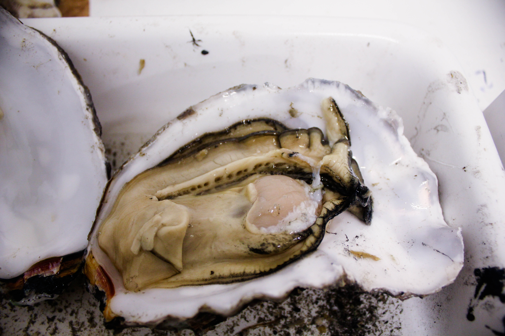
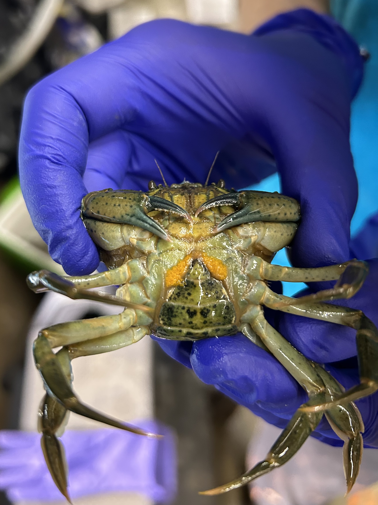
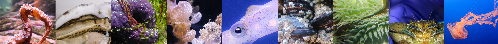

## What is "marine molecular ecophysiology?!"

The MMEP Lab

## Our research themes

### Environmental influence on molecular phenotype

::: {style="float:left"}
```{r, echo=FALSE, out.width= "200px", out.extra='style="float:left; padding:5px"'}

```
:::

### Evolutionary adaptation-phenotypic plasticity tradeoffs

::: {style="float:right"}
```{r, echo=FALSE, out.width= "200px", out.extra='style="float:left; padding:5px"'}

```
:::

### Reproduction and intergenerational plasticity

{fig-align="center" width="3000"}
