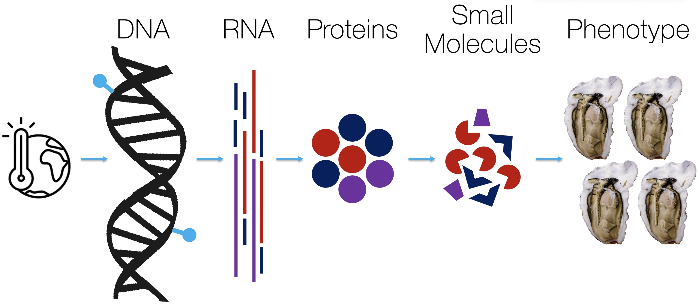
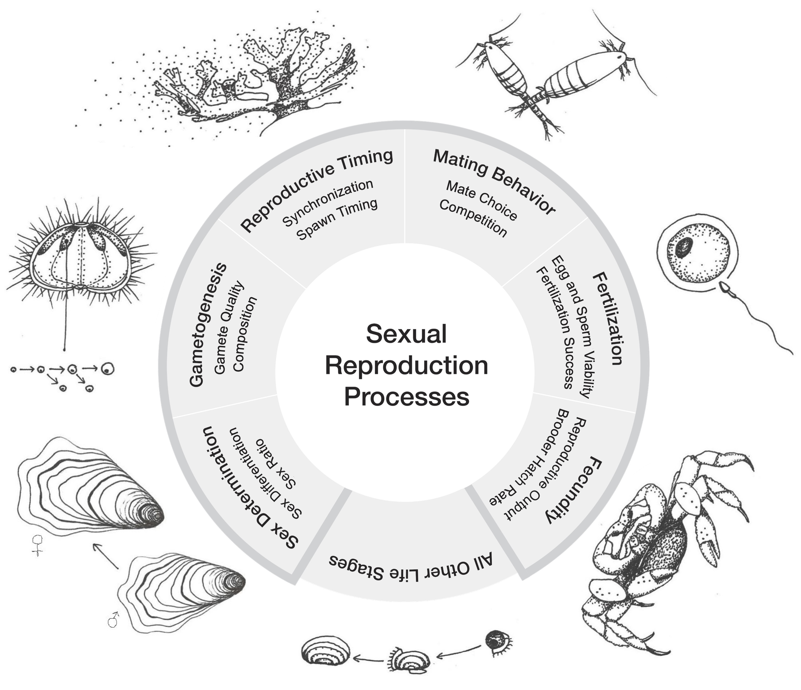

## What is "marine molecular ecophysiology?!"

Imagine someone comes up to you and tells you they can't drive their car. This could mean a lot of things! Perhaps they're out of gas, lost their keys...or their car can be on fire. All of these things end up in the same place: this person cannot drive their car! But understanding *why* they cannot drive is important context.

At the MMEP Lab, we apply this contextual, or mechanistic, thinking to understanding how and why marine invertebrates (ex. oysters, green crabs) respond the way they do to climate related-stressors. **To understand mechanisms underpinning responses, we examine how changes in environmental conditions impact processes scaling up from molecular pathways to observable characteristics, or phenotype**. Through this integrative approach, we can identify responses that are phenotypically plastic, giving us an insight into both mechanisms of resilience and susceptibility to environmental change. Much of our work involves live animal experiments, followed by lab work and bioinformatic analysis.

{fig-align="center" width="3000"}

## Our research themes

### Environmental influence on molecular phenotype

::: {style="float:right"}
```{r, echo=FALSE, out.width= "400px", out.extra='style="float:right; padding-left:10px"'}
knitr::include_graphics("images/oyster.jpg")
```
:::

One potential mechanisms underlying phenotypic plasticity is DNA methylation. Changes to methylomes can regulate gene expression and whole-organism physiology within and across generations. **We conduct foundational research examining how ocean acidification impacts methylomes in adult and larval oysters (*Crassostrea gigas* and *Crassostrea virginica*)**. Previous work from Dr. Venkataraman has established that the oyster methylome is sensitive to ocean acidification, and pH-related methylation differences can impact gene expression homeostasis. Examining this molecular puzzle improves our understanding of how environmental conditions shape plasticity and physiological phenotype.

*Relevant publications*:

-   **Venkataraman YR**, Huffmyer AS, White SJ, Downey-Wall A, Ashey J, Becker DM, Bengtsson Z, Putnam HM, Strand E, Rodriguez-Casariego JA, Wanamaker SA, Lotterhos KE, Roberts SB. “DNA methylation correlates with transcriptional noise in response to elevated pCO~2~ in the eastern oyster (*Crassostrea virginica*).” Ecological Epigenetics. (2024). <https://doi.org/10.1093/eep/dvae018>

-   **Venkataraman YR**, White SJ, Roberts SB, “Differential DNA methylation in Pacific oyster reproductive tissue associated with ocean acidification.” BMC Genomics. (2022). <https://doi.org/10.1186/s12864-022-08781-5>

-   **Venkataraman YR**, Downey-Wall AM, Ries J, Westfield I, White S, Roberts SB, Lotterhos KE, “General DNA methylation patterns and environmentally-induced differential methylation in the eastern oyster (*Crassostrea virginica*).” Frontiers in Marine Science. 7:225 (2020). <https://doi.org/10.3389/fmars.2020.00225>

### Evolutionary adaptation-phenotypic plasticity tradeoffs

::: {style="float:left"}
```{r, echo=FALSE, out.height= "300px", out.extra='style="float:left; padding-right:10px"'}
knitr::include_graphics("images/green-crab.jpg")
```
:::

While plasticity is critical for understanding responses to climate stressors, it is also necessary to consider trade-offs between evolutionary adaptation and phenotypic plasticity. **We examine how adaptation and plasticity interact to shape thermal tolerance in the highly invasive European green crab (*Carcinus maenas*)**. This work couples thermal exposure experiments ranging from 24 hours to six weeks with physiology assays, genotyping, and sample isolation for metabolomic and RNA-Seq analysis. Thus far, our work has found that short-term thermal tolerance is more a product of plasticity than adult genotype.

*Relevant publications*:

-   **Venkataraman YR**, Kelso JC^†^, Payne C^†^, Freitas HL^†^, Jasmine Kohler^†^, Tepolt CK. “Plasticity, not genetics, shapes individual responses to thermal stress in non-native populations of the European green crab (*Carcinus maenas*).” Integrative and Comparative Biology. (2025). <https://doi.org/10.1093/icb/icaf131>
- **Venkataraman YR**, Shapiro SK, Newbrey M^†^, Tepolt CK. “Metabolomic and lipidomic shifts underpin physiological acclimation to thermal stress in the European green crab (*Carcinus maenas*).” bioRXiv. (2026). https://doi.org/10.64898/2026.05.08.723818

### Reproduction and intergenerational plasticity

::: {style="float:right"}
```{r, echo=FALSE, out.width= "550px", out.extra='style="float:right; padding-left:10px"', fig.cap="Figure from Padilla-Gamiño et al. (2022)"}

```
:::

Sexual reproduction and early life stages are uniquely vulnerable to climate change, but research suggests that adult stress exposure can shape offspring fitness. **We use a reproductive biology foundation to address pressing questions in climate change and plasticity research**: 1) How will multiple and/or variable stressors impact invertebrate physiology across generations and biological scales? 2) How would different exposure characteristics (ex. duration, intensity) influence the relationship between molecular responses and observed phenotype? Elements of these questions are being addressed with *Crassostrea spp.* oysters and green crabs, but the MMEP Lab is interested in different animal systems to answer these questions. Stay tuned for more!

*Relevant publications*:

-   **Venkataraman YR**, Huffmyer AS, White SJ, Downey-Wall A, Ashey J, Becker DM, Bengtsson Z, Putnam HM, Strand E, Rodriguez-Casariego JA, Wanamaker SA, Lotterhos KE, Roberts SB. “DNA methylation correlates with transcriptional noise in response to elevated pCO~2~ in the eastern oyster (*Crassostrea virginica*).” Ecological Epigenetics. (2024). <https://doi.org/10.1093/eep/dvae018>

-   Padilla-Gamiño J^§^, Alma L^§^, Spencer LH^§^, **Venkataraman YR**^§^, Wessler L^§^, “Ocean acidification does not overlook sex: Review of understudied effects and implications of low pH on marine invertebrate sexual reproduction.” Frontiers in Marine Science. (2022). <https://doi.org/10.3389/fmars.2022.977754>

-   **Venkataraman YR**, Spencer LH, Roberts S. “Larval response to parental low pH exposure in Pacific oysters (*Crassostrea gigas*).” Journal of Shellfish Research. 38(3):743-750 (2019). <https://doi.org/10.2983/035.038.0325>