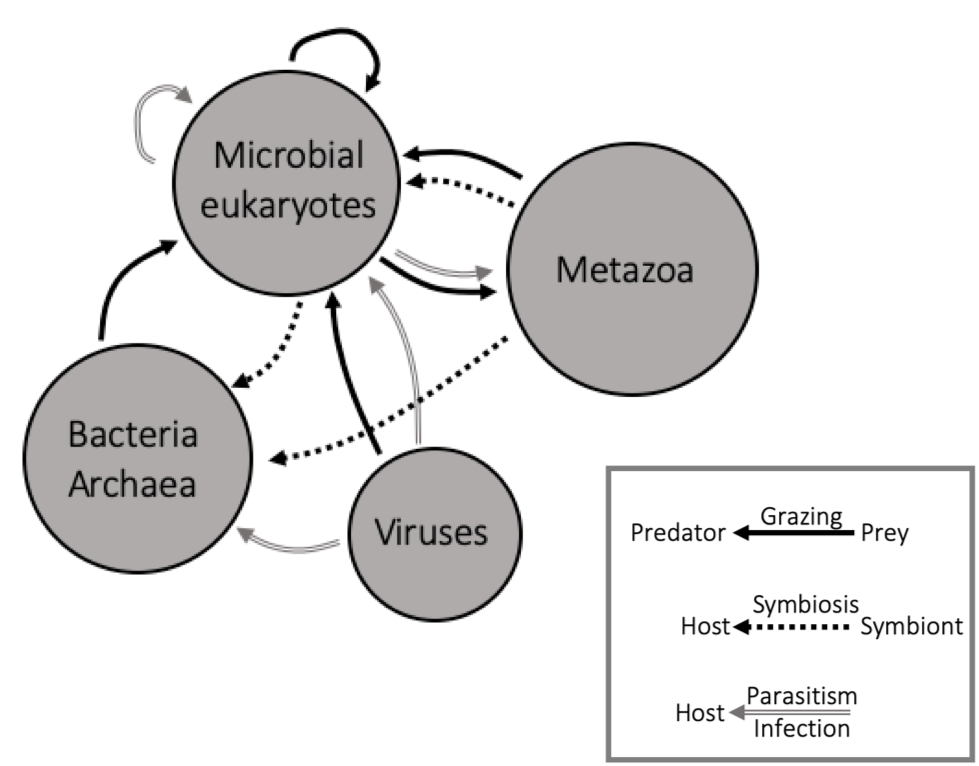
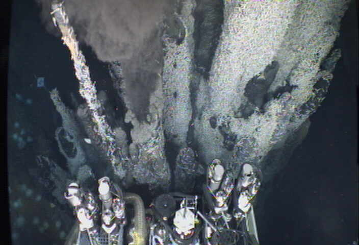
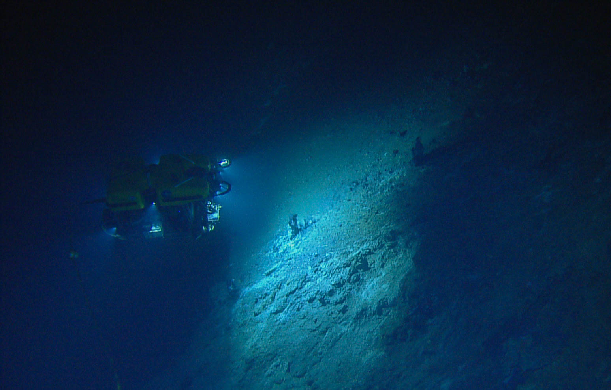
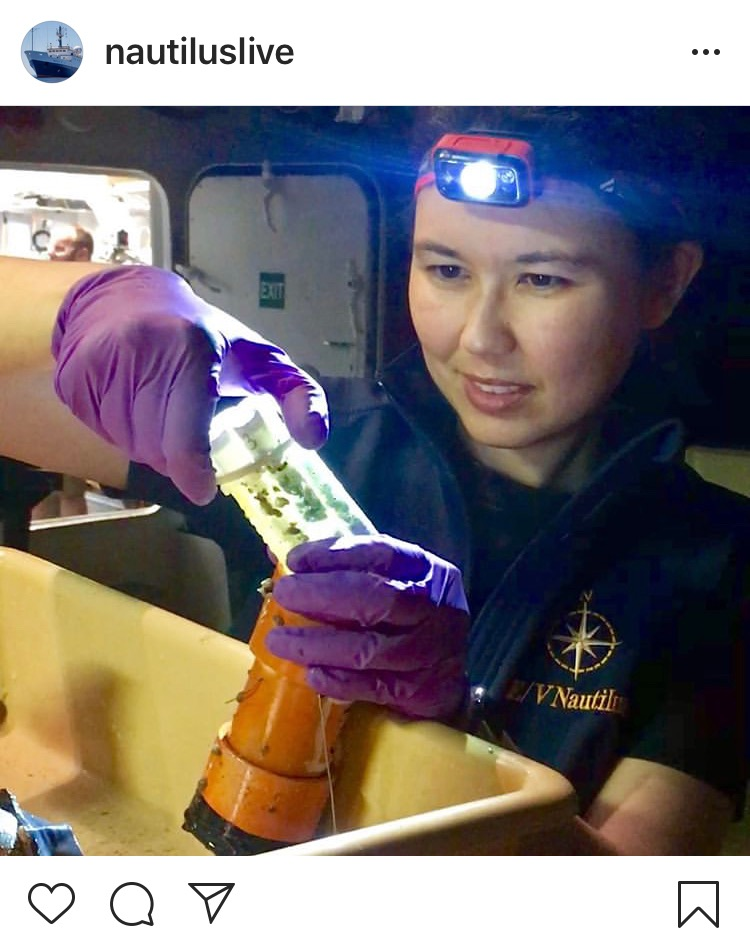

```{r setup, include=FALSE}
knitr::opts_chunk$set(echo = FALSE, fig.align = "center")
```

# Protists
Single-celled microbial eukaryotes _or protists_ are critical team players in most ecosystems on our planet. Protistan communities are composed of hundreds to thousands of species. The species composition of protistan communities can serve as a sentinel of the surrounding environment.

```{r, echo=FALSE}

knitr::include_graphics("images/Screen Shot 2021-09-21 at 12.38.40 PM.png")

# knitr::include_graphics(c("images/00_Acantharia.png", "images/00_Trimyema.pdng", "images/00_Ehux.png", "images/00_Pseudonana.png"))

# cowplot::ggdraw() +
  # draw_image("images/00_Acantharia.png", width = 0.5) +
  # draw_image("images/00_Trimyema.png")
  
```
## Interconnected microbial eukaryome

The _interconnected microbial eukaryome_ means I am interested in the relationship between microbial eukaryotes and their environment, and microbial eukaryotes and other organisms. Research typically starts with questions such as _Who is present?_, _What are they doing?_, and _What is their ecological role in marine environments?_ 

Protistan species make up the majority of the branches on the eukaryotic tree of life. Similar to their vast and complex morphological ( _e.g._, skeletal structure, modes of mobility, and size), the nutritional strategies (or feeding methods) protists are capable of are diverse and complicated. The three core _trophic modes_ include **phototrophy**, **heterotrophy**, and **mixotrophy**. These trophic strategies place protists at the center of marine food webs -- meaning, they mediate or facilitate central routes of energy and nutrient flux. Hence, protists play several key ecological roles at the base of marine food webs.

## Three core research initiatives
From coastal environments to deep-sea habitats, protistan community structure (diversity and composition of species) and nutritional strategies are reflections of their environment. While protists form a central theme in my work, my goal is to make sense of how microorganisms fuel and facilitate the processes sustaining our planet. Through the study of microbial eukaryotes, we learn how diverse nutritional strategies of protists are tied to season, time of day, and availability of resources. My main goal is to understand how protistan communities interact with other microorganisms and their environment to support marine ecosystems.

Three core research themes:
* **Meta'omics to resolve taxon-specific ecological roles** - Leverage temporal & spatial scales to link genotype & phenotype in natural protistan assemblages.
* **Trophic interactions at hydrothermal vent food webs** - Heterotrophic microbial eukaryotes associated with deep-sea vents play an important role in deep-sea carbon cycling.
* **Data science** - Computational biology is a wonderful opportunity for interdisciplinary collaborations. In addition to using data science, I aim to build a "data science community"

Explore how these three themes are intertwined by browsing descriptions of current and past work below.

***
```{r, fig.height=1.5, fig.width=8, echo=FALSE}
ggplot2::ggplot(x = 1, y = 2) + ggplot2::theme_void() + ggplot2::theme(plot.background = ggplot2::element_rect(fill = "#ce536b", colour = NA))
```


# Deep-sea hydrothermal vents

```{r out.width ="40%", echo=FALSE, fig.cap="Mid-Cayman Rise. Credit: WHOI"}
knitr::include_graphics("images/IMG_3510-Edit-Edit.jpg")
```

Highly reduced and thermally charged venting fluids from the subseafloor mix with surrounding seawater, creating a sharp geochemical gradient which promotes a hub of biological diversity at the site of venting fluid. Studies of the bacterial and archaeal chemosynthetic populations at hydrothermal vent sites have highlighted the important roles these microorganisms play in deep-sea carbon cycling and offered a unique window into subseafloor microbiology. To date, studies of deep-sea food webs and ecological interactions do not typically cover the microbial eukaryotic assemblages.

Heterotrophic protists are ubiquitous in all aquatic ecosystems and represent an important ecological link by transferring organic carbon from primary producers to higher trophic levels. Previous work has shown protists to be present and active at deep-sea hydrothermal vents and efforts to characterize the composition of these populations has revealed many species to be heterotrophic grazers and parasites. However, efforts to quantify protistan grazing pressure in the deep sea are rare. 

```{r out.height="2%", echo=FALSE, fig.cap="Simplified food web"}

```

Supported by the [Center for Dark Energy Biosphere Investigations STC](https://www.darkenergybiosphere.org/), I joined [Dr. Julie Huber's lab](https://www2.whoi.edu/staff/jhuber/projects/) at [WHOI](https://www.whoi.edu/). Since 2018, I have been involved in several expeditions to hydrothermal vents (see below) to address these main questions:

> What is the role of protists in deep-sea hydrothermal vent food web ecology? 

> How does protistan diversity, distribution, and activity influence carbon flux in the deep sea?

```{r out.width ="20%", echo=FALSE}
knitr::include_graphics("images/cdebi-logo.png")
```

## Accessing deep-sea food webs

To assess microbial biodiversity, we rely on sequencing the DNA from microbial cells that are collected onto a filter. The genetic material is extracted and sequenced so we can gain a snapshot of the microbial community composition _(who is present?)_. These molecular approaches have been critical in gaining the knowledge we currently have on the microbial communities in deep-sea and difficult to range habitats. Actually getting to deep-sea habitats takes a lot of engineering and planning. Broadly, we can use remotely- or human-operated vehicles (ROVs and HOVs) from a ship. Often we have to run experiments on the ship once the ROV returns with hydrothermal vent fluid or have the ROV collect samples _in situ_.

For this work, I run incubations with diffuse flow fluid collected via ROV to capture the grazing activity of heterotrophic protists. Consumption of microbial prey by protistan grazers (heterotrophs) is a key route of carbon exchange (the transfer of chemosynthetic microorganisms to higher trophic level), and these experiments allow us to obtain a grazing rate (cells consumed ml^-1 day ^day). In order to assess the level of grazing pressure by protists, I compare and contrast the grazing rates and community composisions of protistan assemblages within discharging vent fluid, the plume (hydrothermally-influenced environment above the vent site), and the background deep-sea water. 

```{r out.width ="30%", echo=FALSE}
knitr::include_graphics("images/vent-with-location.png")
```

In aquatic habitats, transition zones driven by changes in chemistry or nutrients can create biological 'hotspots' of microbial activity. Within the hydrothermal vent environment

## Axial Seamount
We are currently planning work at Axial Seamount (NE Pacific Ocean) as part of an [NSF-funded proposal](https://nsf.gov/awardsearch/showAward?AWD_ID=1947776&HistoricalAwards=false) to characterize the rate and route of carbon via phagotrophic protists.

Axial Seamount is an active submarine volcano on the Juan de Fuca Ridge in the NE Pacific Ocean, off the coast of Oregon. The microbiome of the low-temperature (<100C) diffuse vent sites in the region have been frequently studied and the vent field within the caldera include a range of distinct geochemistries. 

### Upcoming expedition

_Summer 2022_ 

***
```{r out.width ="50%", echo=FALSE, fig.cap="Jason van on the RV Atlantis"}
knitr::include_graphics("images/jason-van.jpg")
```
## Mid-Cayman Rise


```{r out.width ="25%", echo=FALSE, fig.cap="ROV Jason during the Mid-Cayman Rise cruise"}
knitr::include_graphics("images/jason-sarah.png")
```

### 2020 Expedition

I was a part of the RV Atlantis (AT42-22) research cruise to study the geochemistry and microbiology of the Von Damm and Piccard vent fields, located on the Mid-Cayman Rise. We completed 9 dives with ROV Jason at the Von Damm and Piccard vent fields. Hydrothermal vent fluid collection was facilitated by the isobaric gas-tight (IGT) fluid samplers (9) and the hydrothermal organic geochemistry (HOG) sampler (Susan Lang). CTD-rosette casts were also conducted to obtain water column plume and background seawater. Relevant objectives included (1) conducting grazing incubations and (2) collecting samples from the hydrothermal vent, plume, and background seawater environments. Laboratory work for analyzing the grazing experiments and cell counts has been completed and the molecular work is in progress.

Samples from Von Damm (10 sites) and Piccard (8 sites) vent fields will provide detailed analysis of the microbial composition, biogeography, and role in the food web. 3 of the grazing experiments originated from CTD-rosette casts from the background and plume environment and 6 were conducted with fluid from the HOG. 4 grazing experiments were performed with the IGT, so incubations remained at _in situ_ pressure.

```{r out.width ="30%", echo=FALSE, fig.cap="Beebe Woods vent at Mid-Cayman Rise. Credit: WHOI"}

```

***

```{r out.width ="100%", echo=FALSE, fig.cap="ROV Hercules at newly discovered Apollo vent field. Credit: OET/Nautilus Live"}

```
## Gorda Ridge


```{r out.width ="30%", echo=FALSE, fig.cap="In the ROV Hercules control van with Amy Smith. Credit: OET/Nautilus Live"}
knitr::include_graphics("images/Sarah-and-Amy-Controlvan-2.jpg")
```

### 2019 Expedition

Sea Cliff and Apollo vent fields along the Gorda Ridge spreading center, located ~200 km off the coast of southern Oregon, were visited in May-June 2019 with the E/V Nautilus (cruise NA108; 5). Low temperature diffuse hydrothermal vent fluid samples <100ºC were collected using the ROV Hercules and a SUspended Particle Rosette Sampler (SUPR; 6). The overarching goal of the cruise was to integrate scientific investigation of the deep sea with the exploration of ocean worlds on other planets, as the deep-sea hydrothermal vent system serves as an analog environment (a part of the SUBSEA program (Systematic Underwater Biogeochemical Science and Exploration Analog)).

Findings from the Gorda Ridge cruise are published: Hu, S.K., Herrera, E.L., Smith, A.R., Pachiadaki, M.G., Edgcomb, V.P., Sylva, S.P., Chan E.W., Seewald, J.S., German, C.R., & Huber, J.A. (2021) Protistan grazing impacts microbial communities and carbon cycling in the deep-sea hydrothermal vent environment. Proc Natl Acad Sci USA [link](https://www.pnas.org/content/118/29/e2102674118) [code](https://shu251.github.io/protist-gordaridge-2021/)


```{r out.width ="20%", echo=FALSE, fig.cap="Sampling microcolonizer experiments on board the EV Nautilus. Credit: OET/Nautilus Live"}

```

```{r out.width ="60%", echo=FALSE, fig.cap="Mt Edwards vent site at Gorda Ridge with microcolonizer experiments. Credit: OET/Nautilus Live"}
knitr::include_graphics("images/mtedwards-cones.png")
```

All 6 microcolonizer experiments (pictured above) were placed on and near active diffuse flow at Mt. Edwards, each had substrates that included: shell (CaCO3) Riftia tubeworm shell (chitin), quartz, pyrite, basalt, and olivine). Microcolonizers experienced a range of temperatures, influenced by the diffusely venting fluid nearby


A summary of my findings were presented as part of the ISOP virtual poster session.

```{r out.width ="80%", echo=FALSE, fig.cap="Graphic comic poster for ISOP, August 2020"}
knitr::include_graphics("images/GR-comic-protistsession-updated.png")
```


```{r, fig.height=1.5, fig.width=8, echo=FALSE}
ggplot2::ggplot(x = 1, y = 2) + ggplot2::theme_void() + ggplot2::theme(plot.background = ggplot2::element_rect(fill = "#b63e36", colour = NA))
```

# Time-series

The diversity of microbial eukaryotic trophic strategies makes them key players in marine food webs. Protists are single-celled microbial eukaryotes that play numerous ecological roles at the epicenter of marine food webs as primary producers, consumers, mixotrophs (mixed phototrophic and heterotrophic nutrition), and as partners in various mutualistic or parasitic associations. Within the diverse array of eukaryotic species, protist functional groups that exhibit heterotrophic nutrition or combined phototrophic and heterotrophic nutrition (mixotrophy) have been especially overlooked, especially from in situ studies.

```{r out.width ="40%", echo=FALSE, fig.cap="SPOT cruise"}
knitr::include_graphics("images/SPOT-fieldwork.png")
```

## the SPOT station

The *S*an *P*edro *O*cean *T*ime-series (SPOT) station is located about half way between the Port of Los Angeles and Santa Catalina Island. [SPOT](https://dornsife.usc.edu/spot/) is a part of the Wrigley Institute and University of Southern California, it is a long-term study site that has been visited, sampled, and studied monthly for over 15 years. As a PhD student, one of my main roles was sampling every month - which meant that in addition to contributing to a long-term sampling effort, I got to ask my own research questions that were scientifically and logistically support by this station. 

Each month, we would conduct CTD casts to obtain oceanographic measurements from the water column surface to just above the bottom (~880 meters). Alongside CTD data, we would capture seawater at each site, including the surface, deep chlorophyll maximum, oxycline (~150 m), and hypoxic depth (~880 m). By collecting this seawater monthly, we have been able to capture seasonal and annual trends in the microbial community (i.e., species richness, relative abundances). 

```{r out.width ="20%", echo=FALSE, fig.cap="Seasonal depth profiles from the SPOT station from Hu et al. 2016"}
knitr::include_graphics("images/SPOT-vert-profile.png")
```

_Findings from the SPOT station_

> The oxycline hosts increased microbial activity.

Naturally-occurring transition zones, such as nutriclines or oxyclines (where oxygen dramatically decreases) attract microorganisms. As a result, there is typically an uptick in microbial species richness, abundance, and activity localized to these sites. Subsequently, microorganisms that consume other microbes (such as protistan heterotrophs) will also be draw to this environment with available prey.

DNA-based observations of microbial eukaryotic populations had revealed that heterotrophic species where present throughout the water column and had a relative increase in the number of species at the oxycline. In a paper from [2016](https://academic.oup.com/femsec/article/92/4/fiw050/2197988), we used both RNA and DNA tag-sequencing analyses to (1) assess if there was a difference in using RNA and DNA in tag-sequence surveys and to (2) determine if this approach could be used to infer metabolic activity.

To access the metabolically-active component of the protistan community at SPOT, we also [applied metatranscriptomics](https://sfamjournals.onlinelibrary.wiley.com/doi/abs/10.1111/1462-2920.14259). After extracting total RNA from each depth at the SPOT station, we isolated and sequenced the messenger RNA. By matching mRNA sequences to reference transcriptome databases, we can annotate the taxonomic origin and gene identity (functional potential). In the case of the metabolically diverse protists, results from the metatranscriptome analysis brought us closer to simultaneously characterizing the trophic mode and taxonomic identity. At the oxycline, there was a distinct shift in the known heterotrophic taxa, such as ciliates - where a relative increase in transcripts related to fatty acid breakdown was observed. Similarly,  taxa known to be mixotrophic (e.g., haptophytes) had distinct transcript profiles in the euphotic and sub-euphotic zones. At the surface, transcripts associated with phototrophy were higher compared to transcripts associated with heterotrophic modes of nutrition at depths without sunlight. 

> Surface phytoplankton community varies according to environment.


```{r out.width ="40%", echo=FALSE, fig.cap="HOT cruise"}
knitr::include_graphics("images/IMG-4423.JPG")
```

## HOT

The [Hawaii Ocean Time-series (HOT)](http://aco-ssds.soest.hawaii.edu/ALOHA/) samples station ALOHA - or A Long-Term Oligotrophic Habitat Assessment monthly. This time series has been running for over 30 years. As part of the Simons Foundation funded SCOPE collaboration, I was able to be involved in several cruises to station ALOHA. This was an exciting opportunity to study the oligotrophic North Pacific Subtropical Gyre and compare our findings and methods to the coastal ecosystem of California.

For one field season, we conducted high-resolution diel sampling by following a parcel of water and sampling every 4 hours. As a result of this work, we captured daily fluctuations in microbial community dynamics, including species compositions, microbe-microbe-interactions, grazing activity, and details of how microbial photosynthetic machinery operates on an hourly time scale. 

> Species-specific nutritional needs drive temporal niche partitioning among protistan primary producers and consumers.


```{r, fig.height=1.5, fig.width=8, echo=FALSE}
ggplot2::ggplot(x = 1, y = 2) + ggplot2::theme_void() + ggplot2::theme(plot.background = ggplot2::element_rect(fill = "#93b778", colour = NA))
```

# Data science

Despite their ecological importance, efforts to catalog protistan physiological abilities and trophic strategies lag behind those of their prokaryotic counterparts. The interpretation of large sequence datasets relies on the knowledge gleaned from culture-based transcriptome studies, new developments in genetic probing of microorganisms, and single-cell sequencing. It is imperative that we build reproducible pipelines and infrastructure to keep up with growing sequence information.

My two data science related goals are to (1) streamline the methods to link genotype and phenotype for environmentally-relevant microbial eukaryotes and (2) create an engaging environment to teach the next generation of scholars methods in computational approaches.

## Reproducible pipelines & Bioinformatic tools

* [EUKHeist](https://github.com/alexanderlabwhoi/EukHeist) & [preprint](https://www.biorxiv.org/content/10.1101/2021.07.25.453713v1)

* [EUKulele](https://eukulele.readthedocs.io/en/latest/) 

* [Tag-sequencing work flows](https://github.com/shu251/tagseq-qiime2-snakemake)

* [Extracting microbial eukaryotic information from metagenomes](https://github.com/shu251/Extract_microeukrRNA_from_metagenome)

* [Analysing microbiome time-series](https://github.com/shu251/analyzing_microbiome_timeseries)

