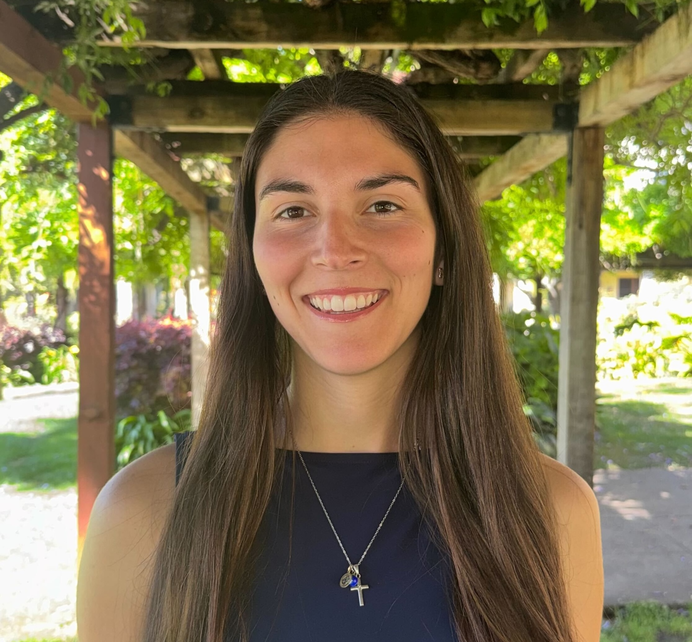
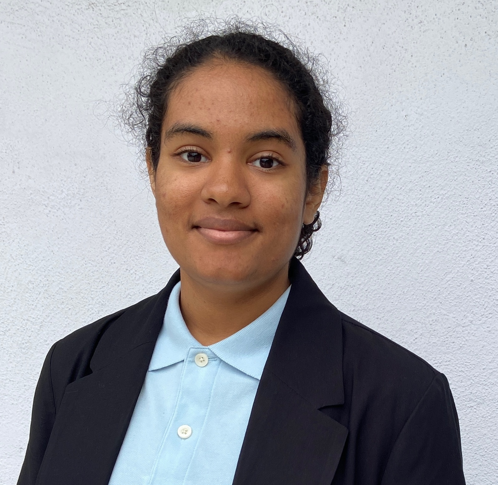
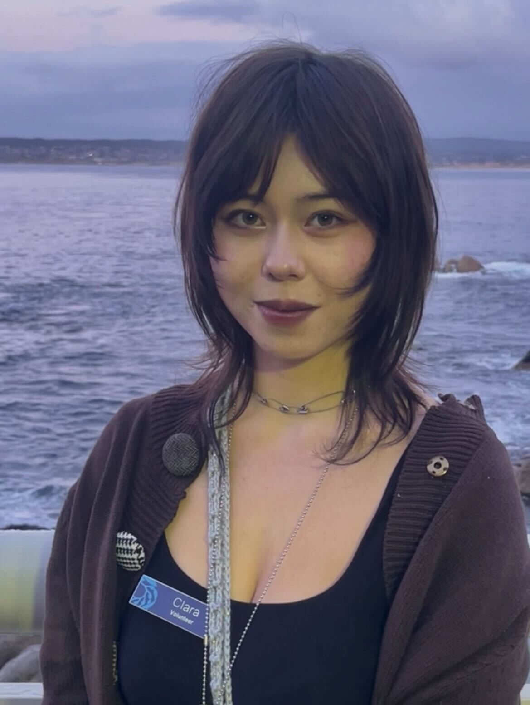
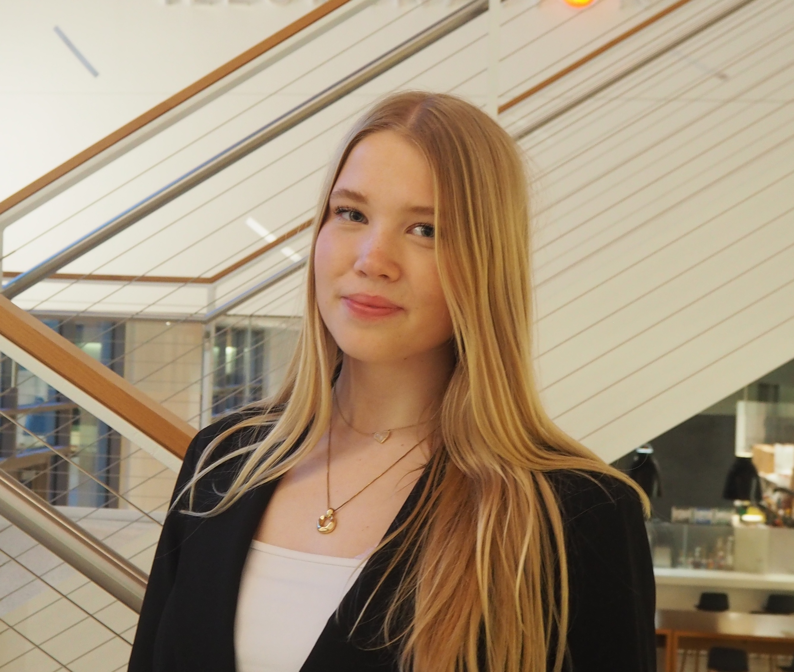
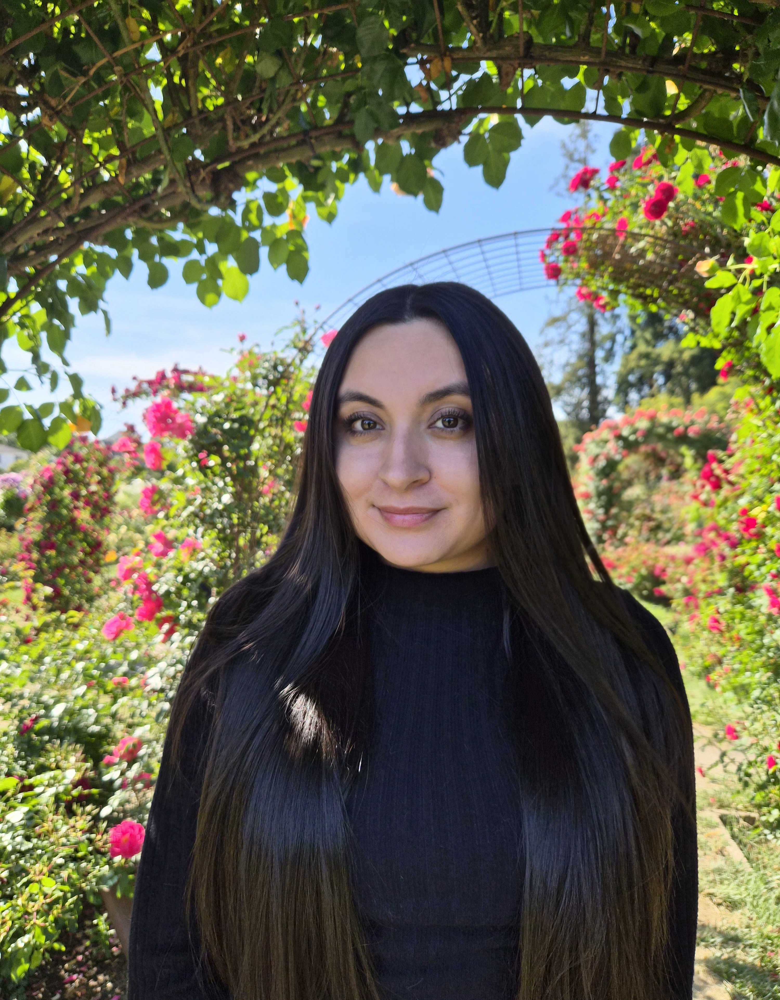

# Current lab members

::: {style="float:left"}
```{r, echo=FALSE, out.width= "350px", out.extra='style="float:left; padding-right:15px; padding-top:15px"', fig.cap = "Photo by Sara Shapiro"}
knitr::include_graphics("images/Venkataraman_Headshot_Cropped.tif")
```
:::

## Dr. Yaamini R. Venkataraman

**Assistant Professor of Biology**

[yvenkataraman\@scu.edu](mailto:yvenkataraman@scu.edu) [ORCID](https://orcid.org/0000-0002-0364-1829) [Google Scholar](https://scholar.google.com/citations?user=x9WA39wAAAAJ&hl=en&oi=sra) [CV](products/Venkataraman_CV.pdf) [Lab notebook](yaaminiv.github.io) she/her

I am a molecular ecophysiologist, meaning I not only delve into how organisms respond to changes in their environment, but also why they respond that way. We combine wet-lab experiments, molecular benchwork, and bioinformatic analysis to understand how climate change impacts marine invertebrates. I'm deeply committed to improving equity and inclusion in academia. I co-lead the Resources for Inclusive Evolution Education (RIE2) initiative, which seeks to improve undergraduate evolution education by creating a central repository that provides educational and science communication resources that address the exclusionary underpinnings of the field. Outside the lab, my favorite activities include being outside (hiking, camping, paddleboarding, beach swimming), cooking extravagant meals for no reason, and consuming copious amounts of media (let's talk books!).

::: {style="float:right"}
```{r, echo=FALSE, out.width= "350px", out.extra='style="float:left; padding-right:15px; padding-top:15px"'"}

```
:::

## Mikaela Bruno

[Lab notebook](https://docs.google.com/document/d/156p6lpch1gTSDPrkZHLP7HjBWkRur8-CPiNjss4SXTI/edit?tab=t.tv39a61tolyh#heading=h.35smbuej444m) she/her

[REAL Program](https://www.scu.edu/real/) funding recipient Summer 2026

I am a new graduate of Santa Clara University where I majored in biology. I’m interested in ecophysiology, particularly how marine organisms respond to environmental stressors like climate change and marine heatwaves. I’m especially curious about the physiological and molecular mechanisms behind stress and recovery in species like crabs. Outside of academics, I love playing volleyball, working with animals, and spending time outdoors. A fun fact about me is that I’m planning to pursue vet school in the future!

::: {style="float:left"}
```{r, echo=FALSE, out.width= "350px", out.extra='style="float:left; padding-right:15px; padding-top:15px"'"}

```
:::

## Sasha Darknell-Brown

[Lab notebook](https://docs.google.com/document/d/1J422olLn7dHSSQc1bTKbC9LEUlelEH18MK-CrD1juT4/edit?tab=t.mqbehiak27x1) she/her

I am a second-year transfer student at Santa Clara University. I am majoring in Biology and minoring in Biotechnology. I am interested in experimental research such as animal physiology, molecular work, and anything else that can go on in the lab. I am still figuring out what it is I would like to focus on, so I want to gain as much experience in different areas of biology as I can. My hobbies include, walking my dogs, drawing, reading, and doing puzzles.

::: {style="float:right"}
```{r, echo=FALSE, out.width= "350px", out.extra='style="float:left; padding-right:15px; padding-top:15px"'"}

```
:::

## Clara Gray

[Lab notebook](https://docs.google.com/document/d/1KMPvsBltbcZBUgqUax1JXUHqDX8W9q23A0sm0T9ZmUA/edit?pli=1&tab=t.wipg68ddo7vc#heading=h.35smbuej444m) they/them

[REAL Program](https://www.scu.edu/real/) funding recipient Summer 2026

I am a second-year student double majoring in Biology and Environmental Science. I am interested in exploring the intersection between marine biology, ecology, and conservation science. I am intrigued by how climate stressors affect marine invertebrates and I am thrilled to investigate this topic in the MMEP lab! Beyond the lab, I enjoy reading (history, philosophy, and marine science books are my favorites!), drawing, being outdoors (hiking and tidepooling especially), and weightlifting.

## Jasmine Fong

[Lab notebook](https://docs.google.com/document/d/1wN_iivSvqCWL5rO3pwCrz-ZIHvlRv5piEsKXmv2jw5Y/edit?tab=t.tv39a61tolyh#heading=h.35smbuej444m)

LEAP Program funding recipient Summer 2026

::: {style="float:right"}
```{r, echo=FALSE, out.width= "350px", out.extra='style="float:left; padding-right:15px; padding-top:15px"'"}

```
:::

## Emma Johansen

[Lab notebook](https://docs.google.com/document/d/1K6tJxHl-_tQnDi9zIDhY1sxgv70URRak4c_z2gCGD40/edit?pli=1&tab=t.2iv11di2nhdb#heading=h.npbng7wbtxob) she/her

I am a third-year biology major with minors in medical and health humanities and biotechnology. I am interested in the effects of multi-stressor experiments on green crab ecophysiology and how the impacts of these stressors can be applied to climate change and invasive species management. Outside of the lab, I enjoy hiking, swimming, volunteering with SCU EMS, thrifting, and spending time with my cats.

::: {style="float:right"}
```{r, echo=FALSE, out.width= "350px", out.extra='style="float:left; padding-right:15px; padding-top:15px"'"}

```
:::

## Noemi Torres

[Lab notebook](https://docs.google.com/document/d/1cjhsooxLtzIYtettOJaJI_uJA0fzRZ34HZ8z5A2nfPQ/edit?tab=t.tv39a61tolyh#heading=h.35smbuej444m) she/her

LEAP Program funding recipient Summer 2026

I am a senior studying Biology at Santa Clara University. I am interested in biomedical research and enjoy hands on lab work that explores how cells and molecules function. I am especially curious about how marine organisms respond to changes in their environment. Outside of school, I enjoy being near the ocean, watching documentaries, and have a fascination with space.

# Join the lab!

**Interested in live animal experiments with marine invertebrates, finessing your molecular bench skills, and/or learning computational data analysis?** Then the MMEP Lab is the place for you! If you would like to work in the MMEP Lab, then fill out this Google Form and I will contact you when I have an opening.

During the school year, I expect students to enroll in Biol 195 for 1-2 units and work 5-10 hours/week. Students who are interested in working in the lab over the summer are encouraged to apply for internal funding opportunities:

- [Single Portal for Undergraduate Research (SPUR)](https://www.scu.edu/provost/research/student-funding-opportunities/scuspur/): Single application portal for several SCU summer research fellowships
- [REAL Program](https://www.scu.edu/real/): Stipends for College of Arts and Sciences student research, internships, or creative projects

I typically work with students only after they have completed the [IBE](https://www.scu.edu/cas/biology/academic-programs/introductory-biology-experience/). **I only work with SCU undergraduates. I do not work with high schoolers or undergraduate students from other institutions.**

# Lab Alumni

- Ashray Bangalore (January 2026-June 2026): Research technician at Stanford University
